# Creating VM with requirements

Homework for infosec courses

## The Task

Разверните виртуальную машину на любом дистрибутиве, основанном на Debian (Ubuntu, Debian…).

```bash
# creating virtual hard drive
qemu-img create -f qcow2 jammy.qcow2 40G

# running installation from ubuntu 22.04 iso
# press ESC on boot to enter bios and select boot order, if feel it necessary
qemu-system-x86_64 -enable-kvm -smp 2 -m 3G -bios /usr/share/edk2/ovmf/OVMF_CODE.fd -drive file=jammy.qcow2,format=qcow2,index=1,media=disk -drive file=/home/user/Downloads/ubuntu-22.04.4-live-server-amd64.iso,format=raw,index=0,media=cdrom

# running installed VM through proxychains to avoid regional restrictions
# my proxy setup is out of scope
proxychains qemu-system-x86_64 -enable-kvm -smp 2 -m 3G -bios /usr/share/edk2/ovmf/OVMF_CODE.fd -drive file=jammy.qcow2,format=qcow2,index=0,media=disk -nic hostfwd=tcp:127.0.0.1:9922-0.0.0.0:22
```

### Выполните настройку по чек-листу:

1. Установить SSH-сервер и настроить удалённое подключение по ключам, вместо пароля.

```bash
# from VM

sudo apt update
sudo apt install -y sshd

if [ ! -f $HOME/.ssh/id_ed25519.pub ]; then
	ssh-keygen -t ed25519
fi
```

```bash
# from host machine
ssh-copy-id -p 9922 petr@localhost
```

```bash
# from VM
sudo vi /etc/ssh/sshd_config
```


```bash
# from VM
sudo systemctl restart sshd
```

```bash
# from host machine
ssh -p 9922 petr@localhost
```

<details>
<summary>Screenshot -- SSH connection successful</summary>


</details>

2. Создать нового пользователя с домашней директорией и выдать ему возможность запускать следующие утилиты без требования пароля:

- /sbin/route, /sbin/iptables, /usr/bin/nmap, /usr/sbin/hping3
- usr/bin/systemctl
- sbin/ifup, /sbin/ifdown

```bash
sudo useradd -m user5
```


<details>
<summary>Some fixes for new user - making bash the default shell</summary>


</details>

<details>
<summary>Checking if AppArmor enabled</summary>

```bash
# in VM
# check if AppArmor is enabled
systemctl list-unit-files | grep apparmor
```


</details>

Allowing to run some binaries without password:

```bash
# in VM
sudo vi /etc/sudoers
```


3. Установить минимальную длину пароля для пользователя в 8 символов.

```bash
sudo vi /etc/pam.d/common-password
```


4. Установить на сервер пакеты Java.

```bash
sudo apt install -y openjdk-21-jre
```

<details>
<summary>Figuring out the latest available version</summary>

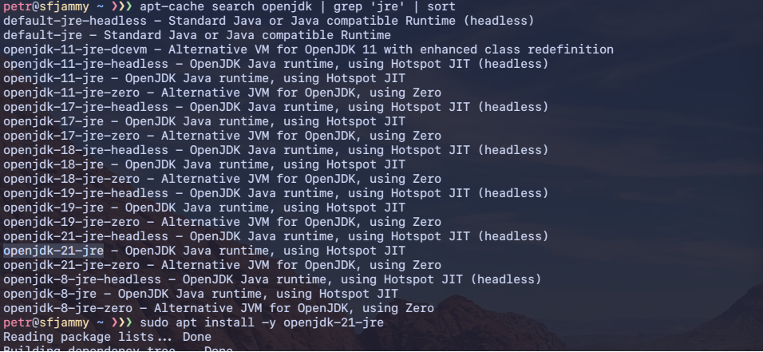

</details>

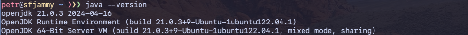

5. Настроить автоматическое сканирование антивирусом всей ОС каждый понедельник в 4 утра. При этом раз в месяц должно происходить обновление базы данных антивирусов.

<details>
<summary>ClamAV install, update and first scan -- code</summary>

```bash
# install
CLAMAV_VERSION=$(curl -s "https://api.github.com/repos/Cisco-Talos/clamav/releases/latest" | grep tag_name | cut -d'"' -f4)
wget "https://github.com/Cisco-Talos/clamav/releases/latest/download/$CLAMAV_VERSION.linux.x86_64.deb"
sudo apt install -y ./$CLAMAV_VERSION.linux.x86_64.deb
sudo apt install -y clamav-daemon

# stop daemons
sudo systemctl stop clamav-freshclam
sudo systemctl disable clamav-freshclam
sudo systemctl stop clamav-daemon.service

# ensure default config
sudo rm -f /usr/local/etc/freshclam.conf
sudo rm -f /usr/local/etc/clamd.conf
sudo ln -s /etc/clamav/freshclam.conf /usr/local/etc/freshclam.conf
sudo ln -s /etc/clamav/clamd.conf /usr/local/etc/clamd.conf
sudo rm /var/log/clamav/freshclam.log

# turn it on back
sudo systemctl start clamav-daemon.service

# update for a first time
sudo freshclam --show-progress

# scan for a first time
sudo clamscan --recursive /
```

</details>

<details>
<summary>ClamAV update successful -- screenshot</summary>

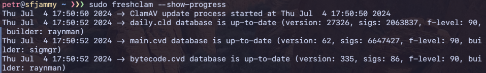

</details>

<details>
<summary>ClamAV scan results -- screenshot</summary>

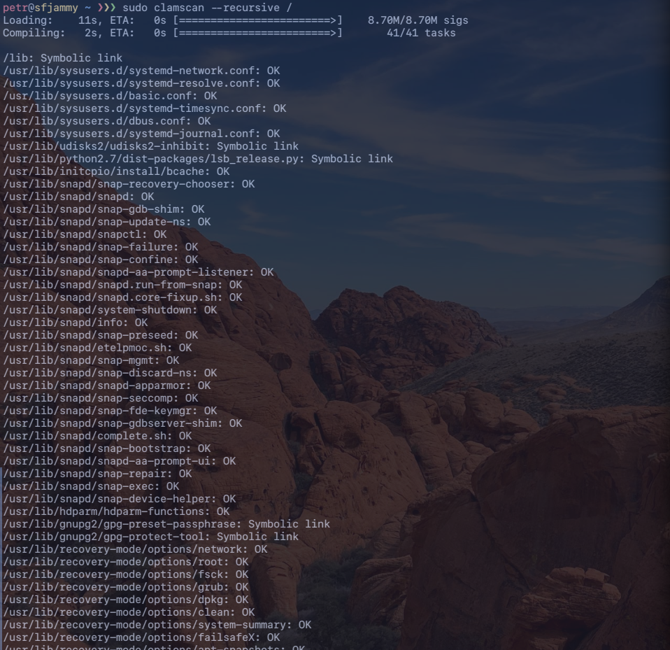

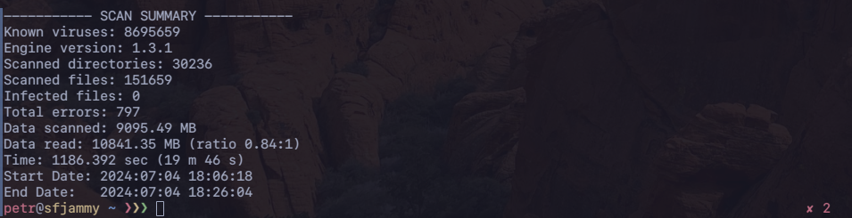

</details>

```bash
sudo mkdir -p /var/log/clamav
# create cron jobs
if ! sudo crontab -l | grep -q '0 4 \* \* 1 /usr/local/bin/clamscan -i --recursive / >> /var/log/clamav/daily_antivirus.log'; then
	sudo crontab -l | {
		cat
		echo '0 4 * * 1 /usr/local/bin/clamscan -i --recursive / >> /var/log/clamav/daily_antivirus.log'
	} | sudo crontab -
fi

if ! sudo crontab -l | grep -q '0 0 1 \* \* /usr/local/bin/freshclam'; then
	sudo crontab -l | {
		cat
		echo '0 0 1 * * /usr/local/bin/freshclam'
	} | sudo crontab -
fi
```

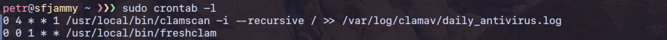

<details>
<summary>ClamAV log contents</summary>

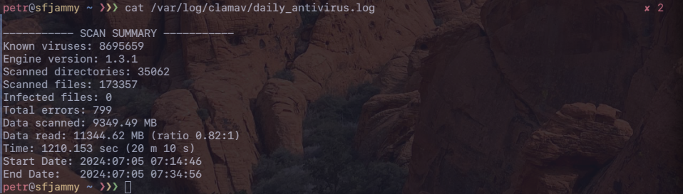

</details>

6. Настроить файервол на блокирование всего входящего и выходящего трафика.

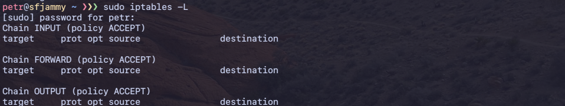

```bash
# clean all rules, if any
sudo iptables -F

# setting to drop all incoming and outgoing, including forwarding
sudo iptables -P INPUT DROP
sudo iptables -P FORWARD DROP
sudo iptables -P OUTPUT DROP
```

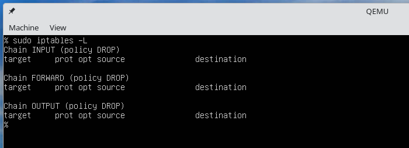

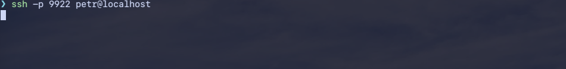


<details>
<summary>Reverting iptables back</summary>

```bash
sudo iptables -P INPUT ACCEPT
sudo iptables -P FORWARD ACCEPT
sudo iptables -P OUTPUT ACCEPT
```

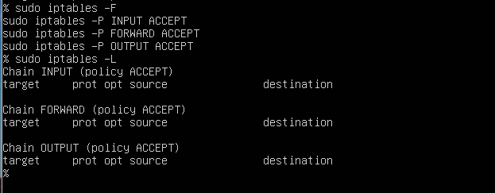

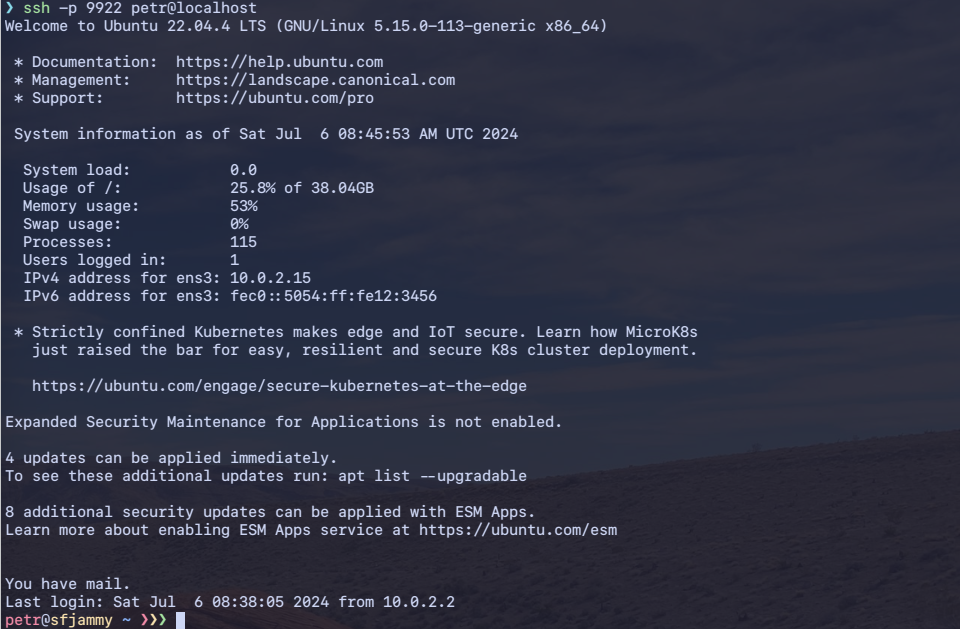

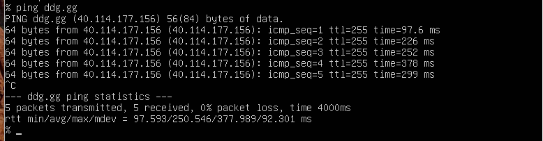

</details>

### УСЛОВИЯ РЕАЛИЗАЦИИ:

По каждому пункту нужно предоставить:

- Команду / набор команд / текст, которыми вы пользовались для выполнения задания.
- Скриншот результата работы / получившегося файла.
 

### ДОПОЛНИТЕЛЬНАЯ ИНФОРМАЦИЯ:

- По пункту 1 предоставьте всё содержимое конфигурационного [файла sshd](./assets/sshd_config) и содержимое файла [authorized_keys](./assets/authorized_keys.png).
- По пункту 2 предоставьте [вывод команды ls в директории home](./assets/26-ls-and-passwd.png), вывод файла [passwd](./assets/passwd), содержимое файла [sudoers](./assets/sudoers).
- По пункту 3 самостоятельно найдите информацию по установке минимального пароля. В качестве ответа предоставьте содержимое файла [common-passwords](./assets/common-password).
- По пункту 4 предоставьте [результат успешной установки Java](./assets/13-java-version.png) (последняя доступная версия JRE).
- По пункту 5 предоставьте [тексты задач cron, содержимое файла crontab](./assets/17-clamav-cronjobs.png) (скрипт Bash — пожеланию)
- По пункту 6 предоставьте [вывод всех цепочек и правил iptables](./assets/20-iptables-drop-policy.png).

