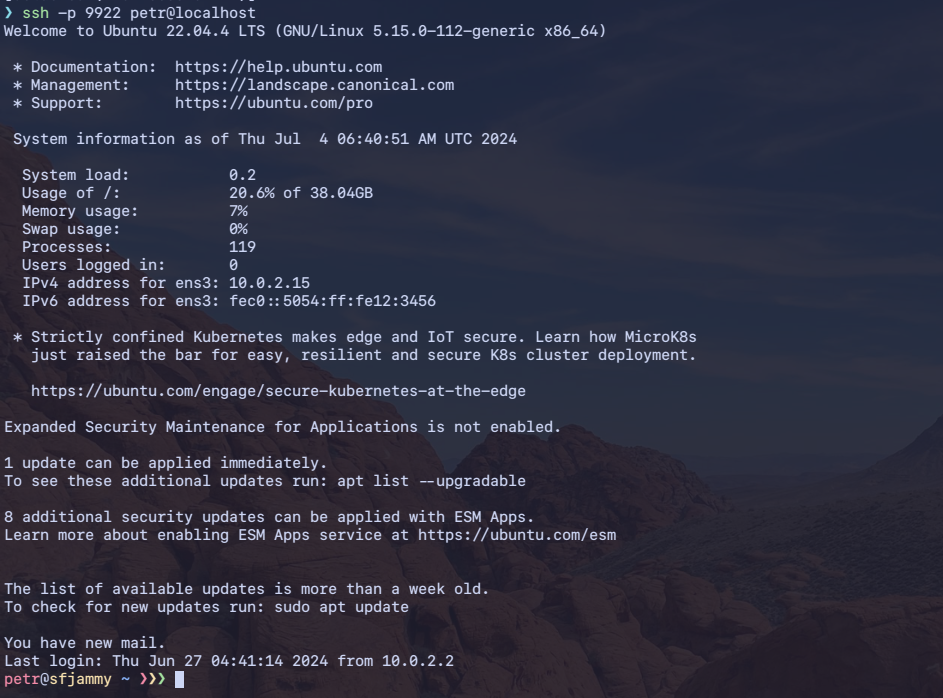

# Creating VM with requirements

Homework for infosec courses

## The Task

Разверните виртуальную машину на любом дистрибутиве, основанном на Debian (Ubuntu, Debian…).

```bash
# creating virtual hard drive
qemu-img create -f qcow2 jammy.qcow2 40G

# running installation from ubuntu 22.04 iso
# press ESC on boot to enter bios and select boot order, if feel it necessary
qemu-system-x86_64 -enable-kvm -smp 2 -m 3G -bios /usr/share/edk2/ovmf/OVMF_CODE.fd -drive file=jammy.qcow2,format=qcow2,index=1,media=disk -drive file=/home/user/Downloads/ubuntu-22.04.4-live-server-amd64.iso,format=raw,index=0,media=cdrom

# running installed VM
qemu-system-x86_64 -enable-kvm -smp 2 -m 3G -bios /usr/share/edk2/ovmf/OVMF_CODE.fd -drive file=jammy.qcow2,format=qcow2,index=0,media=disk -nic hostfwd=tcp:127.0.0.1:9922-0.0.0.0:22
```

### Выполните настройку по чек-листу:

1. Установить SSH-сервер и настроить удалённое подключение по ключам, вместо пароля.

```bash
# from VM

sudo apt update
sudo apt install -y sshd

if [ ! -f $HOME/.ssh/id_ed25519.pub ]; then
	ssh-keygen -t ed25519
fi
```

```bash
# from host machine
ssh-copy-id -p 9922 petr@localhost
```

```bash
# from VM
sudo vi /etc/ssh/sshd_config
```


```bash
# from VM
sudo systemctl restart sshd
```

```bash
# from host machine
ssh -p 9922 petr@localhost
```



2. Создать нового пользователя с домашней директорией и выдать ему возможность запускать следующие утилиты без требования пароля:

- /sbin/route, /sbin/iptables, /usr/bin/nmap, /usr/sbin/hping3
- usr/bin/systemctl
- sbin/ifup, /sbin/ifdown

```bash
sudo useradd -m user5
```


<details>
<summary>Some fixes for new user</summary>

</details>


```bash
# in VM
# check if AppArmor is enabled
systemctl list-unit-files | grep apparmor
```


```bash
# in VM
sudo vi /etc/sudoers
```


3. Установить минимальную длину пароля для пользователя в 8 символов.

```bash
sudo vi /etc/pam.d/common-password
```


4. Установить на сервер пакеты Java.
5. Настроить автоматическое сканирование антивирусом всей ОС каждый понедельник в 4 утра. При этом раз в месяц должно происходить обновление базы данных антивирусов.
6. Настроить файервол на блокирование всего входящего и выходящего трафика.

### УСЛОВИЯ РЕАЛИЗАЦИИ:

По каждому пункту нужно предоставить:

- Команду / набор команд / текст, которыми вы пользовались для выполнения задания.
- Скриншот результата работы / получившегося файла.
 

### ДОПОЛНИТЕЛЬНАЯ ИНФОРМАЦИЯ:

- По пункту 1 предоставьте всё содержимое конфигурационного файла sshd и содержимое файла [authorized_keys](./assets/authorized_keys).
  - [ ] create some additional key which I can share, connect from this key (from another VM?)
- По пункту 2 предоставьте вывод команды ls в директории home, вывод файла passwd, содержимое файла sudoers.
- По пункту 3 самостоятельно найдите информацию по установке минимального пароля. В качестве ответа предоставьте содержимое файла common-passwords.
- По пункту 4 предоставьте результат успешной установки Java (последняя доступная версия JRE).
- По пункту 5 предоставьте тексты задач cron, содержимое файла crontab (скрипт Bash — пожеланию)
- По пункту 6 предоставьте вывод всех цепочек и правил iptables.
